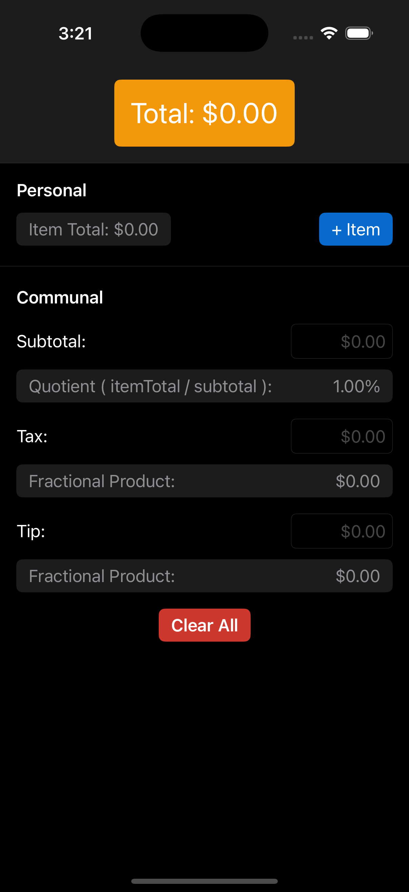
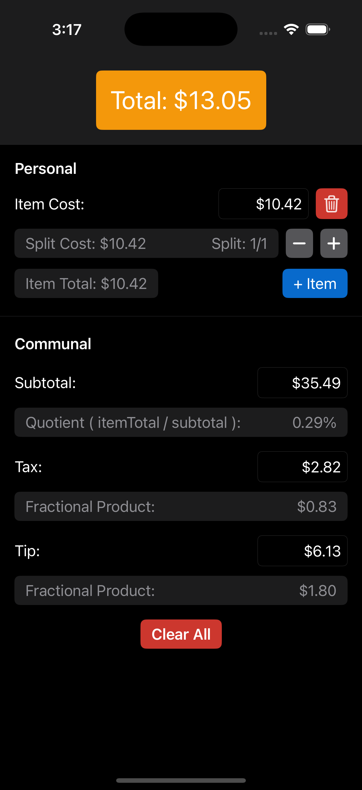

# venmoCalc

venmoCalc is a native iOS application designed to help users calculate exact Venmo amounts when splitting a check.

---

We’ve all been out, sharing a meal with friends, and decided it would be easiest for one person to pay. Then, everyone else Venmos what they owe to that person. It sounds easy, but no one wants to do the calculations required to figure out how much they really owe. This almost always results in people guessing and either underpaying or overpaying. venmoCalc offers a solution to this!

The application intuitively guides users through inputting data in the same flow it appears on a receipt. To start, the user enters the individual costs of what they ordered (e.g., California Roll – $11.99). For each of these item costs, the user has the option to split the cost. This is useful for shared items (e.g., Nachos – $8.73, Split – 1/4). As the user inputs item costs, they are summed into the Item Total. This is then used with the Subtotal of the bill to calculate the user’s Quotient. Finally, this allows the user’s exact portion of the bill to be calculated, resulting in a Final Total.

## Screenshots

  
  
  

## Tech Stack

**Client:** Swift, SwiftUI

## Appendix

Item Cost: Individual (pre-tax) cost of an item

Item Total: The sum of all provided Item Costs

Subtotal: The (pre-tax) total of ALL items (INCLUDING items you did not order) from the bill

Quotient: The result of mathematical division. Represents the ratio of Item Total / Subtotal

Fractional Product: The result of muliplying fractions. Used when applying the user's quotient to Tax and Tip
